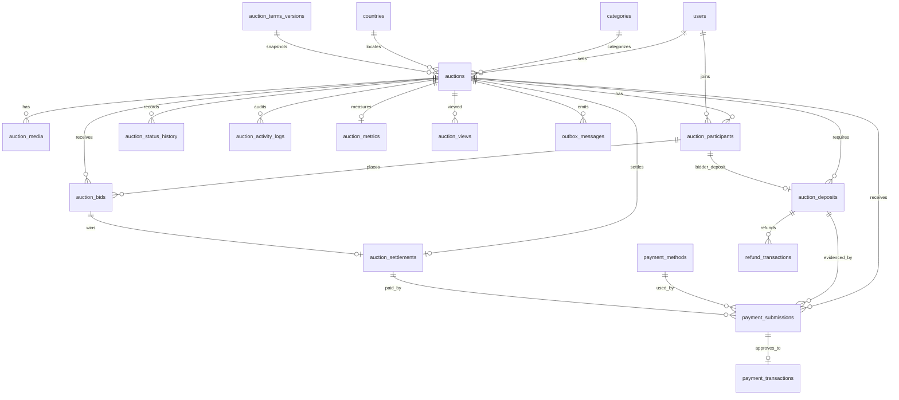

# Auction ERD

```mermaid
erDiagram
    users ||--o{ auctions : sells
    categories ||--o{ auctions : categorizes
    countries ||--o{ auctions : locates
    auction_terms_versions ||--o{ auctions : snapshots
    auctions ||--o{ auction_media : has
    auctions ||--o{ auction_participants : has
    users ||--o{ auction_participants : joins
    auction_participants ||--o{ auction_bids : places
    auctions ||--o{ auction_bids : receives
    auctions ||--o{ auction_deposits : requires
    auction_participants ||--o| auction_deposits : bidder_deposit
    auctions ||--o{ payment_submissions : receives
    auction_deposits ||--o{ payment_submissions : evidenced_by
    payment_methods ||--o{ payment_submissions : used_by
    payment_submissions ||--o| payment_transactions : approves_to
    auctions ||--o| auction_settlements : settles
    auction_bids ||--o| auction_settlements : wins
    auction_settlements ||--o{ payment_submissions : paid_by
    auction_deposits ||--o{ refund_transactions : refunds
    auctions ||--o{ auction_status_history : records
    auctions ||--o{ auction_activity_logs : audits
    auctions ||--o| auction_metrics : measures
    auctions ||--o{ auction_views : viewed
    auctions ||--o{ outbox_messages : emits
```
