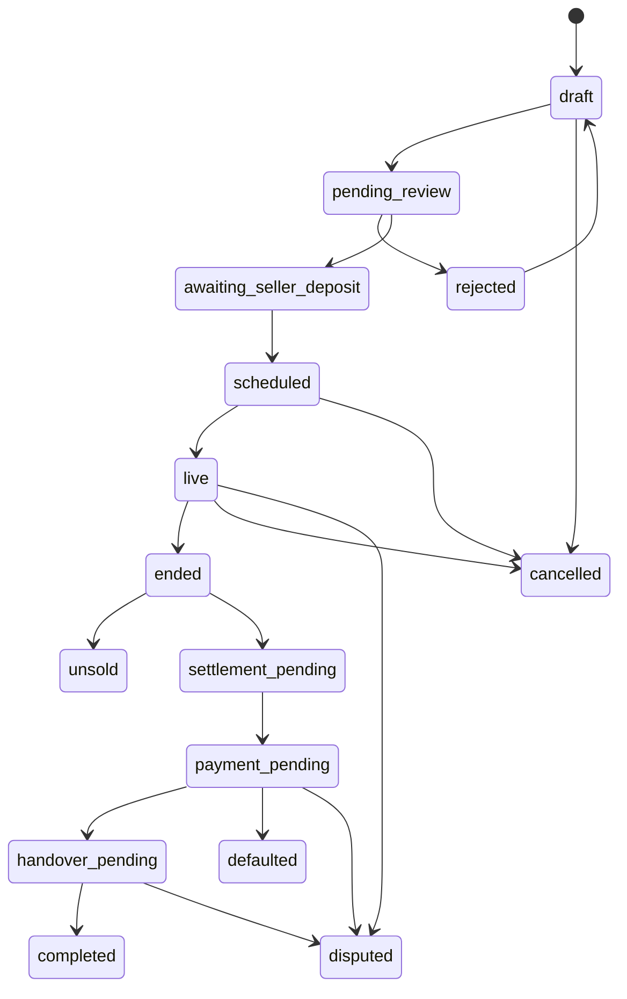
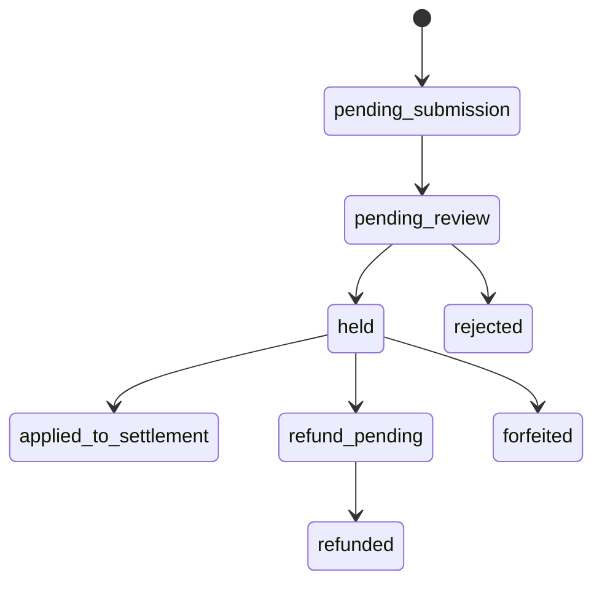
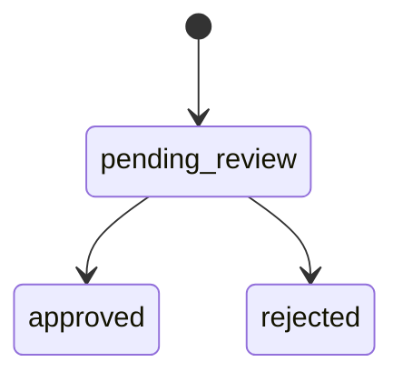
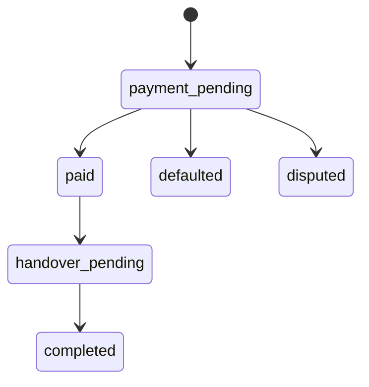
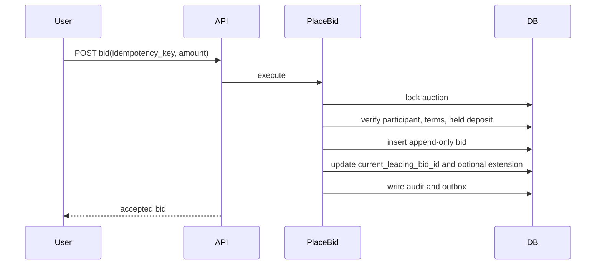
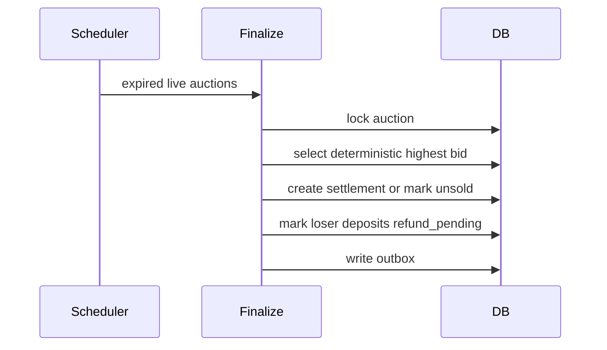
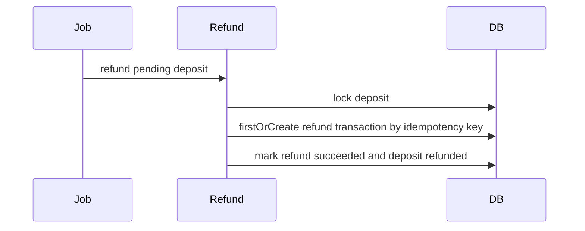
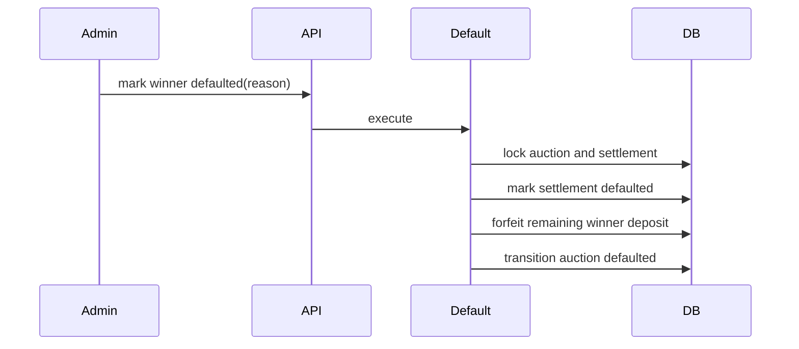
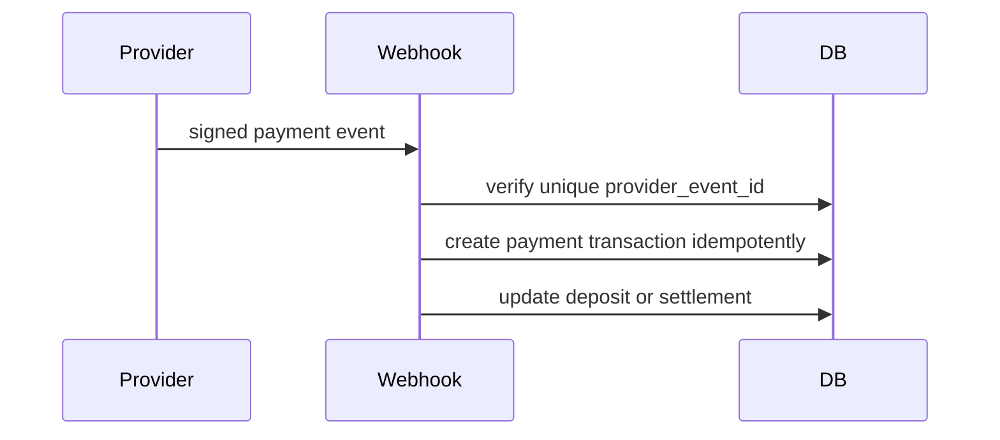

# Auction State Machines

## Auction

```mermaid
stateDiagram-v2
    [*] --> draft
    draft --> pending_review
    draft --> cancelled
    pending_review --> rejected
    pending_review --> awaiting_seller_deposit
    rejected --> draft
    awaiting_seller_deposit --> scheduled
    scheduled --> live
    scheduled --> cancelled
    live --> ended
    live --> cancelled
    ended --> unsold
    ended --> settlement_pending
    settlement_pending --> payment_pending
    payment_pending --> handover_pending
    payment_pending --> defaulted
    handover_pending --> completed
    live --> disputed
    payment_pending --> disputed
    handover_pending --> disputed
```

## Deposit

```mermaid
stateDiagram-v2
    [*] --> pending_submission
    pending_submission --> pending_review
    pending_review --> held
    pending_review --> rejected
    held --> applied_to_settlement
    held --> refund_pending
    held --> forfeited
    refund_pending --> refunded
```

## Payment

```mermaid
stateDiagram-v2
    [*] --> pending_review
    pending_review --> approved
    pending_review --> rejected
```

## Settlement

```mermaid
stateDiagram-v2
    [*] --> payment_pending
    payment_pending --> paid
    paid --> handover_pending
    handover_pending --> completed
    payment_pending --> defaulted
    payment_pending --> disputed
```

## Sequences

```mermaid
sequenceDiagram
    participant User
    participant API
    participant PlaceBid
    participant DB
    User->>API: POST bid(idempotency_key, amount)
    API->>PlaceBid: execute
    PlaceBid->>DB: lock auction
    PlaceBid->>DB: verify participant, terms, held deposit
    PlaceBid->>DB: insert append-only bid
    PlaceBid->>DB: update current_leading_bid_id and optional extension
    PlaceBid->>DB: write audit and outbox
    API-->>User: accepted bid
```

```mermaid
sequenceDiagram
    participant Scheduler
    participant Finalize
    participant DB
    Scheduler->>Finalize: expired live auctions
    Finalize->>DB: lock auction
    Finalize->>DB: select deterministic highest bid
    Finalize->>DB: create settlement or mark unsold
    Finalize->>DB: mark loser deposits refund_pending
    Finalize->>DB: write outbox
```

```mermaid
sequenceDiagram
    participant Job
    participant Refund
    participant DB
    Job->>Refund: refund pending deposit
    Refund->>DB: lock deposit
    Refund->>DB: firstOrCreate refund transaction by idempotency key
    Refund->>DB: mark refund succeeded and deposit refunded
```

```mermaid
sequenceDiagram
    participant Admin
    participant API
    participant Default
    participant DB
    Admin->>API: mark winner defaulted(reason)
    API->>Default: execute
    Default->>DB: lock auction and settlement
    Default->>DB: mark settlement defaulted
    Default->>DB: forfeit remaining winner deposit
    Default->>DB: transition auction defaulted
```

```mermaid
sequenceDiagram
    participant Provider
    participant Webhook
    participant DB
    Provider->>Webhook: signed payment event
    Webhook->>DB: verify unique provider_event_id
    Webhook->>DB: create payment transaction idempotently
    Webhook->>DB: update deposit or settlement
```
